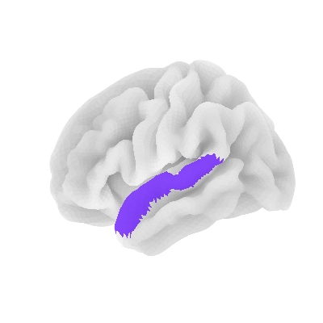

# cortical-plotting

    

Plotting some regions of the brain using prespecified atlases.

| Function | Method | Atlas |
| -------- | ------ | ----- |
| `surface_plot()` | Plot cortical ROI on inflated or pial brain. Customize colors. | Destrieux |
| `plot_hoc_label` | Plot ROI within 2d slice. Can choose axis. | Harvard-Oxford cortl-maxprob-thr50-1mm |

> All atlases are accessed via `nilearn.datasets`. 

